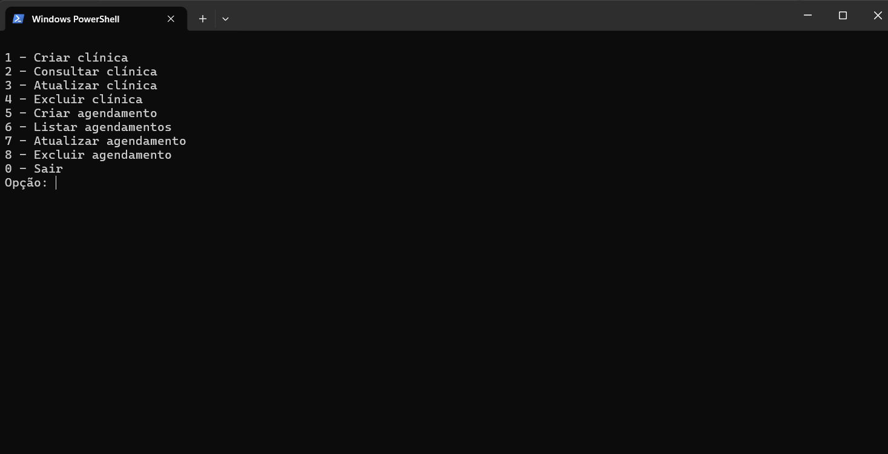
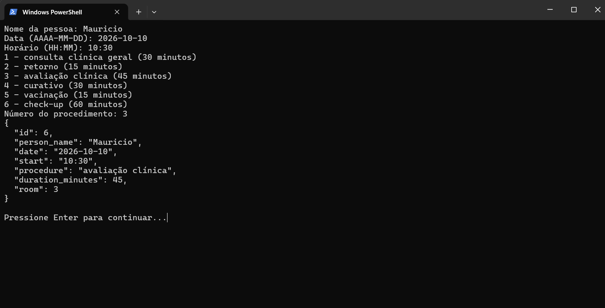
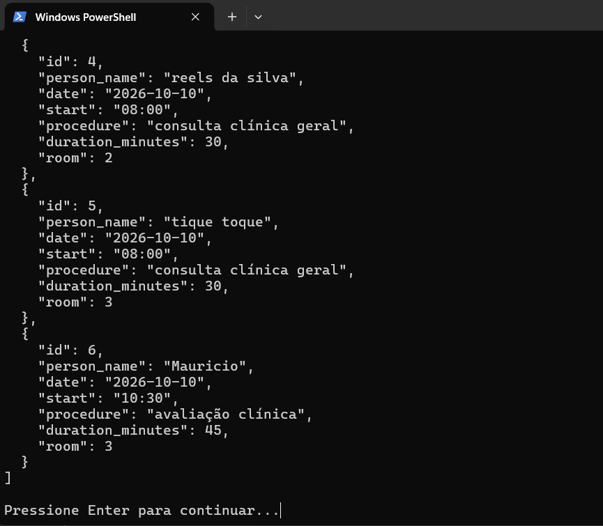

# G40_greedy_PA26.2

Número da Lista: 40<br>
Conteúdo da Disciplina: Algoritmos Gulosos

## Alunos

| Matrícula | Aluno                       |
| --------- | --------------------------- |
| 231011515 | Isaque Camargos Nascimento  |
| 231011088 | Ana Luiza Soares de Cavalho |

<table>
  <tr>
    <td align="center">
      <a href="https://github.com/Ana-Luiza-SC">
        
        <br />
        <sub><b>Ana Luiza Soares</b></sub>
      </a>
    </td>
    <td align="center">
      <a href="https://github.com/isaqzin">
        
        <br />
        <sub><b>Isaque Camargos</b></sub>
      </a>
    </td>
  </tr>
</table>

## Sobre

Este projeto implementa uma simulação de um sistema de agendamentos para uma ONG. O objetivo principal é aplicar o _Interval Partitioning_ para abrir a menor quanitdade de salas possíveis e assim otimizar a quantidade de consultas realizadas ao mesmo tempo.

Por ser uma ONG, dentro do código foi limitado o máximo de salas a serem abertas, para o exemplo foi utilizado 3 salas, visto que não há médicos para todo mundo. Mas para cada agendamento novo, será realizado o algoritmo, de forma que um paciente pode trocar de sala dependendo da demanda de consultas. Não há necessidade de uma alocação específica de sala, visto que todos os médicos são clínicos gerais e não há um procedimento disponível que necessite de uma especialidade específica.

## Screenshots







## Instalação

Linguagem: Python 3.12.3<br>

Não há dependências externas. Execute na raiz do projeto:

```bash
python main.py
```

## Uso

Escolha um mapa e um algoritmo adversário. A corrida começa imediatamente:

- Cadastre a clínica que você deseje utilizar (já há cadastrado uma clinica, para testes não precisa criar outra);
- cadastre a quantidade de salas e os médicos associados a ela;
- agende consultas;
- visualize as consultas agendadas e suas salas associadas.

## Vídeo

[Clique aqui para assistir ao vídeo.](https://youtu.be/9q4y-D66-Z4)
